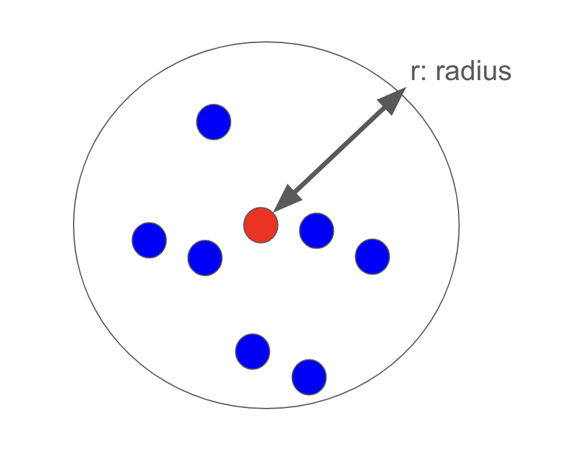
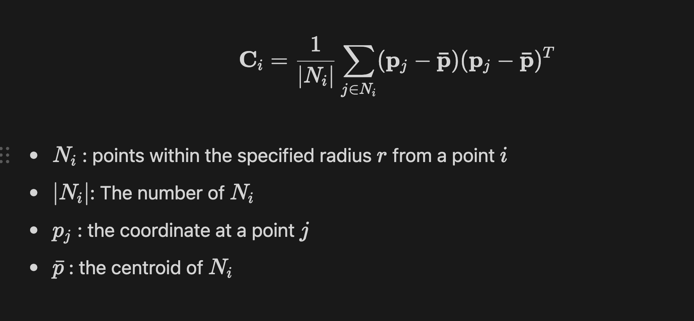
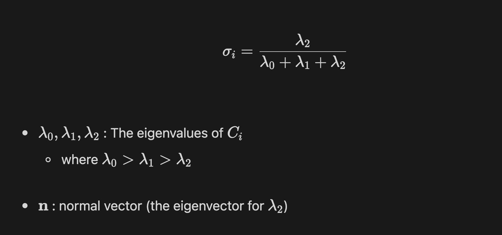
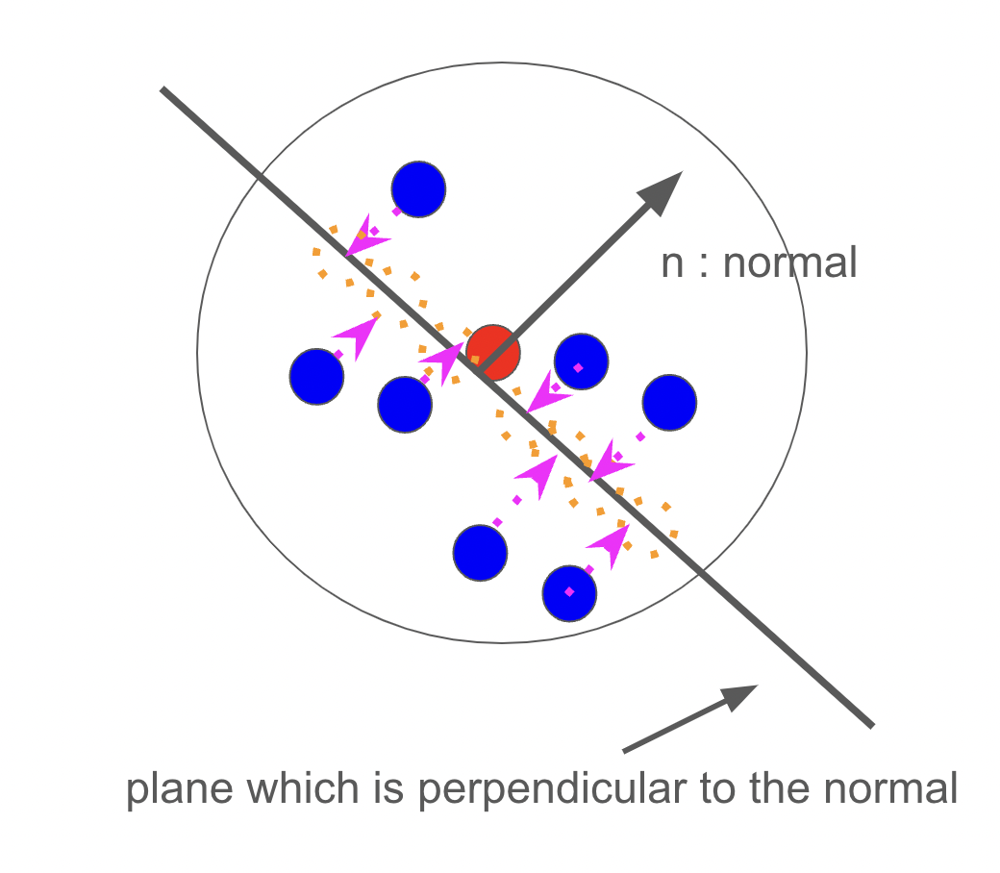

# 3D data processing

Implement the following 3D data processing.

- [Covariance matrix \& Approximate Curvature](#covariance-matrix--approximate-curvature)
  - [covariance matrix](#covariance-matrix)
  - [approximate curvature](#approximate-curvature)
  - [Remarks](#remarks)
- [Projection of points to the plane](#projection-of-points-to-the-plane)
  - [References](#references)

## Covariance matrix & Approximate Curvature

The workflow is:

1. Calculate the covariance matrix at a point with an index `i`.
2. Calculate the approximate curvature at the point `i` by using the covariance matrix computed above.

### covariance matrix

The covariance matrix at a point with an index `i` is defined as follows:

The computation of the covariance matrix at a point is already implemented in `Open3D`.
However, you need to implement it (by using `numpy` etc.) without using [the existing method in `Open3D`](https://www.open3d.org/docs/release/python_api/open3d.geometry.PointCloud.html#open3d.geometry.PointCloud.compute_mean_and_covariance).

### approximate curvature

The approximate curvature at a point `i` is defined as follows:

### Remarks

- To extract points within the specified radius from a given point, you can use `KDTreeFlann` implemented in `Open3D`: See [References](#references).
- You do not need to compute the covariance matrix and the approximate curvature for all the points as the computational cost would be too heavy: You need to compute only for specified point.

## Projection of points to the plane

Project points within the radius at a point with index `i` to the plane which is perpendicular to the normal at the point `i`.

The workflow is

1. Derive the plane at the point `i`. (Computation of the normal at given point should be already implemented in the process of calculating the approximate curvature above.)
2. Project points with in the radius `r` at a point `i` to the plane above.

### References

- kdtree
  - [API](https://www.open3d.org/docs/release/python_api/open3d.geometry.KDTreeFlann.html#open3d.geometry.KDTreeFlann.search_radius_vector_3d)
  - [tutorial](https://www.open3d.org/docs/release/tutorial/geometry/kdtree.html#Using-search_radius_vector_3d)
- convert from open3d to numpy
  - [API](https://www.open3d.org/docs/release/python_api/open3d.geometry.PointCloud.html#open3d.geometry.PointCloud.points)
  - [tutorial](https://www.open3d.org/docs/release/tutorial/geometry/working_with_numpy.html#From-open3d.PointCloud-to-NumPy)
